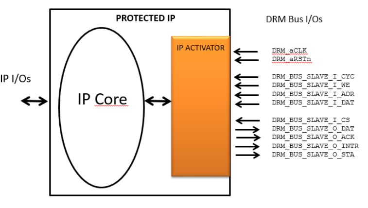

Implementation guidelines
=========================

IP core instrumentation
-----------------------

A protected IP, or DRM Enabled IP, consists of the assembly of an IP Core and the IP Activator:

   
with the IP Activator to retrieve its activation code and to control the activation duration and the metering increment.

The IP Vendor designs the IP core behavior based on the Activation Code values (128 bits) and its validity.

**Reset and Clock**:

The IP Core clock domain and the DRM Bus clock domain can be asynchronous, the IP Activator component implements the CDC (Clock Domain Crossing).

The resets are active low and asynchronous with the clocks.

**IP Activator Interface**:

A specific interface shall be prepared in the IP Core to further communicate with the IP Activator.

.. list-table::
   :header-rows: 1

   * - Name
     - Direction
     - Size
     - Description
   * - IP_CORE_aCLK
     - out
     - 1
     - IP Core clock domain
   * - IP_CORE_aRSTn
     - out
     - 1
     - IP Core Asynchronous Reset (active low)
   * - DRM_EVENT
     - out
     - 1
     - IP Core control to decrement an Activation timer and increment the Meterin counter
   * - ACTIVATION_CODE
     - in
     - 128
     - The Activation Code (synchronous to IP_CORE_aCLK)
   * - ACTIVATION_CODE_READY
     - in
     - 1
     - the Activation Code is ready (synchronous to IP_CORE_aCLK)
   * - DEMO_MODE
     - in
     - 1
     - the license is credit based i.e. temporary (synchronous to IP_CORE_aCLK)

FPGA supported
--------------

Below the table that provides FPGA families supported by DRM Controller IP

.. list-table::
   :header-rows: 1

   * - FPGA Vendor
     - Families
   * - **Xilinx**
     - ultrascale+, ultrascale, virtex 7, virtex 6, spartan 6, spartan 3a dsp,spartan 3a, kintex 7, artix 7
   * - **Intel**
     - cyclone v, arria 10,  arria v gz, arria v, stratix v

FPGA tools supported 
--------------------

Below the table that provides FPGA programming tools supported by DRM Controller IP

.. list-table::
   :header-rows: 1

   * - FPGA Vendor
     - Versions
   * - **Xilinx**
     - Vivado 2018.2, 2017.4, 2017.2, 2016.4, 2016.2
   * - **Intel**
     - Quartus Prime v18.1, v18.0, v17.1, v17.0, v16.1, v16.0
     
     

Implementation results
----------------------

.. list-table::
   :header-rows: 1

   * - FPGA
     - LUT
     - FF
     - RAM
   * - **Kintex ultrascale+**
     - 2200
     - 1800
     - 2 of 36Kbits, 18 of 18Kbits
   * - **Kintex 7**
     - 2400
     - 1900
     - 18 of 36Kbits

     